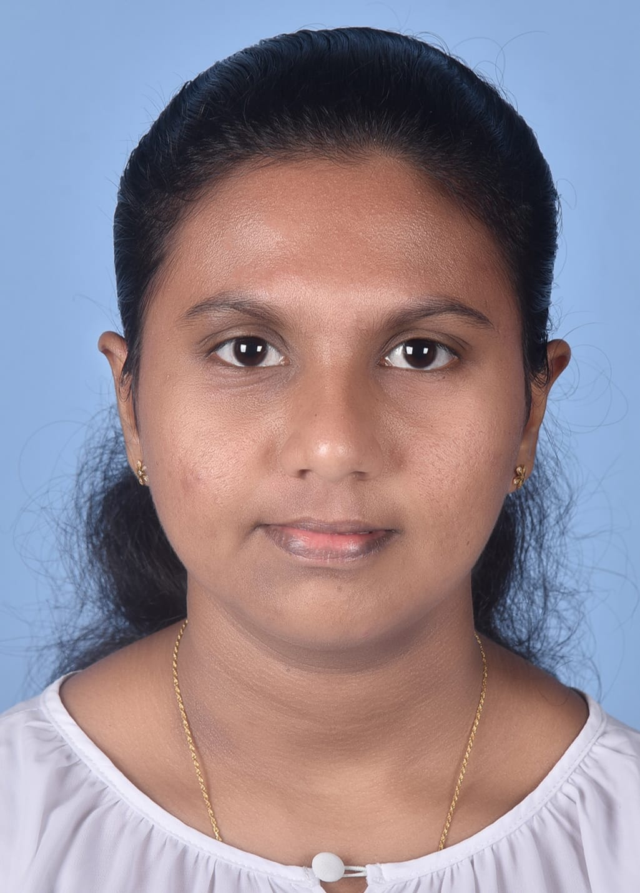

<Portfolio>
<html lang="en">
<head>
<meta charset="UTF-8">
<meta name="viewport" content="width=device-width, initial-scale=1.0">
<title>Sethuli Sahasna — Biotechnology Portfolio</title>
<meta name="description" content="E-portfolio of Sethuli Sahasna, BSc (Hons) Biotechnology undergraduate at SLIIT.">

<link rel="preconnect" href="https://fonts.googleapis.com">
<link rel="preconnect" href="https://fonts.gstatic.com" crossorigin>
<link href="https://fonts.googleapis.com/css2?family=Fraunces:opsz,wght@9..144,400;9..144,500;9..144,600&family=Inter:wght@400;500;600&family=IBM+Plex+Mono:wght@400;500&display=swap" rel="stylesheet">

</head>
<body>

<header class="nav">
  

    <a class="brand" href="#top">
      S
      Sethuli Sahasna
    </a>
    <nav class="nav-links" id="navlinks">
      <a href="#about">About</a>
      <a href="#education">Education</a>
      <a href="#skills">Skills</a>
      <a href="#activities">Activities</a>
      <a href="#contact">Contact</a>
      <a class="btn btn-ghost" href="cv.pdf" download>Download CV</a>
    </nav>
    <button class="menu-toggle" id="menuToggle" aria-label="Menu">☰</button>
  

</header>

<section class="hero" id="top">
  <svg class="helix" viewBox="0 0 200 600" fill="none" aria-hidden="true">
    <g stroke="#1E7A54" stroke-width="2">
      <path d="M40 0 C160 60 40 120 160 180 C40 240 160 300 40 360 C160 420 40 480 160 540 C90 570 90 570 100 600"/>
      <path d="M160 0 C40 60 160 120 40 180 C160 240 40 300 160 360 C40 420 160 480 40 540 C110 570 110 570 100 600"/>
    </g>
    <g stroke="#34B27C" stroke-width="1.5">
      <line x1="55" y1="30" x2="145" y2="30"/><line x1="70" y1="60" x2="130" y2="60"/>
      <line x1="55" y1="150" x2="145" y2="150"/><line x1="70" y1="120" x2="130" y2="120"/>
      <line x1="55" y1="210" x2="145" y2="210"/><line x1="70" y1="240" x2="130" y2="240"/>
      <line x1="55" y1="330" x2="145" y2="330"/><line x1="70" y1="300" x2="130" y2="300"/>
      <line x1="55" y1="390" x2="145" y2="390"/><line x1="70" y1="420" x2="130" y2="420"/>
      <line x1="55" y1="510" x2="145" y2="510"/><line x1="70" y1="480" x2="130" y2="480"/>
    </g>
  </svg>

  

    

      Biotechnology Undergraduate · SLIIT
      <h1>Sethuli Sahasna</h1>
      
Curious about what happens at the bench. I'm building hands-on lab experience and looking for a molecular biology or biochemistry internship where I can learn fast and contribute.

      

        <a class="btn btn-solid" href="cv.pdf" download>↓ Download my CV</a>
        <a class="btn btn-ghost" href="#contact">Get in touch</a>
      

      

        Laboratory work
        Molecular biology
        Fast learner
        Team player
      

    

    

      
      
SS

    

  

</section>

<section id="about">
  

    

      01 — About me
      <h2>Who I am</h2>
    

    

      I'm an undergraduate reading for a <strong>BSc (Hons) in Biotechnology</strong> at SLIIT.
      I like the practical side of science — handling lab work, understanding how systems and
      processes fit together, and figuring out problems quickly. Right now I'm looking for an
      <strong>internship in a molecular biology or biochemistry setting</strong>, ideally in a
      fast-paced clinical or diagnostics lab, where I can turn what I've learned into real
      experience. As a former <strong>Air Scout</strong> and an active <strong>Gavel Club</strong>
      member, I bring strong communication, teamwork and time-management skills to everything I take on.
    

  

</section>

<section id="education">
  

    

      02 — Education
      <h2>Academic background</h2>
      
My path from secondary school through to my degree.

    

    

      

        
2025 — Present

        

          <h3>BSc (Hons) in Biotechnology</h3>
          
Sri Lanka Institute of Information Technology (SLIIT)

          <ul>
            <li>Undergraduate degree currently in progress (Year 1)</li>
            <li>Coursework across biological sciences, laboratory safety and IT fundamentals</li>
          </ul>
        

      

      

        
2024

        

          <h3>G.C.E. Advanced Level — Bio Science stream</h3>
          
Chemistry · Physics · Biology

          <ul>
            <li>Three "C" passes across Chemistry, Physics and Biology</li>
          </ul>
        

      

      

        
2020

        

          <h3>G.C.E. Ordinary Level</h3>
          
Secondary education

          <ul>
            <li>6 "A" passes in the main subjects</li>
            <li>A — Tamil Language &nbsp;·&nbsp; A — Information &amp; Communication Technology</li>
            <li>B — English Literature</li>
          </ul>
        

      

    

  

</section>

<section id="skills">
  

    

      03 — Skills
      <h2>What I bring</h2>
    

    

      

        
Core skills

        <ul class="list">
          <li>Handling laboratory work and procedures</li>
          <li>Quickly learning new systems and processes to solve problems</li>
          <li>Microsoft Word, PowerPoint and Excel</li>
          <li>Time management and organisation</li>
        </ul>
      

      

        
Languages

        <ul class="list">
          <li>English — fluent</li>
          <li>Tamil — fluent comprehension, basic speaking</li>
        </ul>
      

    

  

</section>

<section id="activities">
  

    

      04 — Activities &amp; leadership
      <h2>Beyond the classroom</h2>
      
Where I've built communication, teamwork and discipline.

    

    

      

        <h4>Air Scouts</h4>
        
Member — developed teamwork, leadership, discipline and communication.

      

      

        <h4>Gavel Club, SLIIT</h4>
        
Member of the SLIIT community club, focused on public speaking.

      

      

        <h4>School Red Cross Society</h4>
        
Member — emergency response and first-aid awareness.

      

      

        <h4>Prefect Board</h4>
        
School prefect — responsibility, leadership and organisation.

      

      

        <h4>Traditional Kandyan Dancing</h4>
        
Graduate in traditional Kandyan dance.

      

    

  

</section>

<section id="hobbies">
  

    

      05 — Hobbies
      <h2>Off the clock</h2>
    

    

      Kandyan dancing
      Public speaking
      Volunteering
      Scouting
    

  

</section>

<section id="contact">
  

    

      06 — Contact
      <h2>Let's talk</h2>
      
Open to internship opportunities in molecular biology, biochemistry and diagnostics. The quickest way to reach me is email.

      

        

          
Email

          
<a href="mailto:Sethuli987@gmail.com">Sethuli987@gmail.com</a>

        

        

          
Phone

          
<a href="tel:+94776970982">077 697 0982</a>

        

        

          
Location

          
Wathugedara, Sri Lanka

        

      

      <a class="btn" href="cv.pdf" download>↓ Download my resume (PDF)</a>
    

  

</section>

<footer>
  

    
©  Sethuli Sahasna · Biotechnology E-Portfolio

    
SC1172 — Introduction to Information Technology · HS26510010

  

</footer>

</body>
</html>
